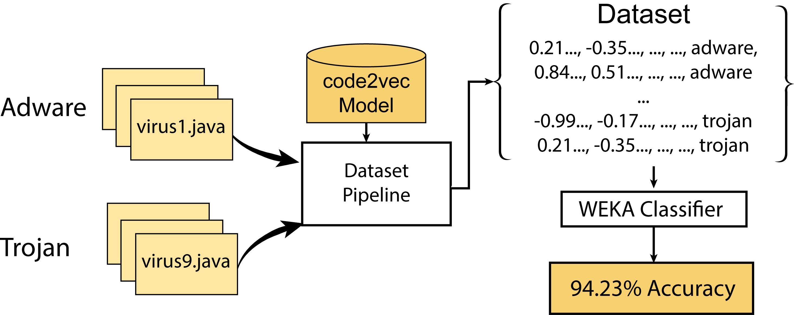
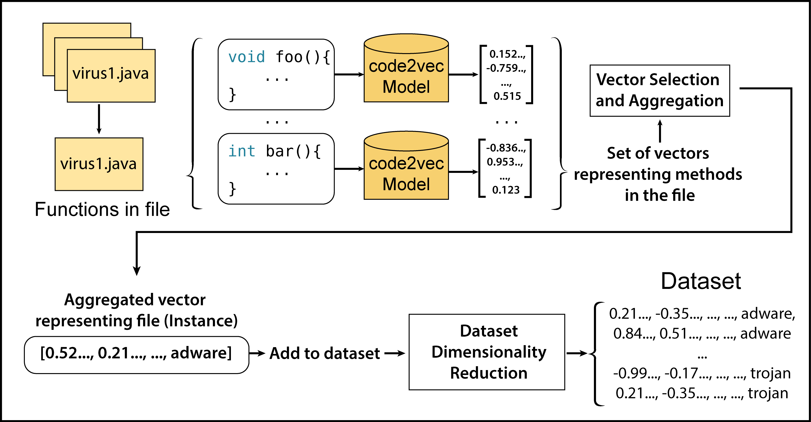
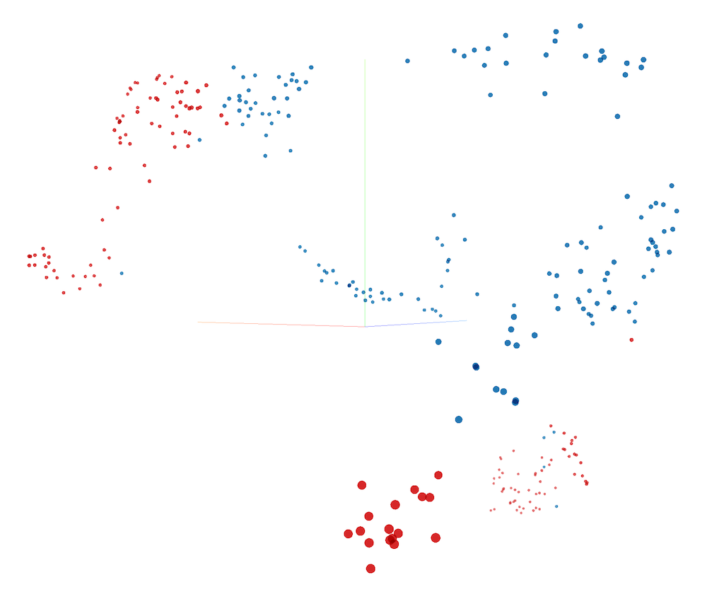

# Embedding Java Classes with code2vec: Improvements from Variable Obfuscation



Code for the paper: *Embedding Java Classes with code2vec: Improvements from Variable Obfuscation*

This repository contains code for the dataset pipeline, as well as the obfuscation tool used for obfuscating the datasets.

All of the model-related code (`common.py`, `model.py`, `PathContextReader.py`) as well as the `JavaExtractor` folder is code from the original [code2vec repository](https://github.com/tech-srl/code2vec). This was used for invoking the trained code2vec models to create method embeddings.

## Requirements
- Java 8+
- Python 3

## Usage - Obfuscator
1. `cd java-obfuscator`
1. Locate a folder of `.java` files (e.g., from the [code2seq](https://github.com/tech-srl/code2seq) repository)
2. Alter the input and output directories in `obfs-script.sh`, as well as the number of threads of your machine. If you're running this on a particularly large folder (e.g., millions of files) then you may need to increase the `NUM_PARTITIONS` to 3 or 4, otherwise memory issues can occur, grinding the obfuscator to a near halt.
3. Run `obfs-script.sh` i.e. `$ source obfs-script.sh`

This will result in a new obfuscated folder of `.java` files, that can be used to train a new obfuscated code2vec model (or any model that performs learning from source code for that matter).

## Usage - Dataset Pipeline



These steps will convert a classification dataset of `.java` files into a numerical form (`.arff` by default), that can then be used with any standard WEKA classifier.

The dataset should be in the form of those supplied with this paper i.e.:
```
dataset_name
|-- class1
    |-- file1.java
    |-- file2.java
    ...
|-- class2
    |-- file251.java
    |-- file252.java
    ...

...
```

To run the dataset pipeline and create class-level embeddings for a dataset of Java files:
1. `cd pipeline`
2. `pip install -r requirements.txt`
1. Download a `.java` dataset (from the datasets supplied or your own) and put in the `java_files/` directory
2. Download a code2vec model checkpoint and put the checkpoint folder in the `models/` directory
3. Change the paths and definitions in `model_defs.py` and number of models in `scripts/create_datasets.sh` to match your setup
4. Run `create_datasets.sh` (`source scripts/create_datasets.sh`). This will loop through each model and create class-level embeddings for the supplied datasets. The resulting datasets will be in `.arff` format in the `weka_files/` folder. 

You can now perform class-level classification on the dataset using any off-the-shelf WEKA classifier.

### Config
By default the pipeline will use the full range of values for each parameter, which creates a huge number of resulting `.arff` datasets (>1000). To reduce the number of these, remove (or comment out) some of the items in the arrays in `reduction_methods.py` and `selection_methods.py` (at the end of the file). Our experiments showed that the `SelectAll` selection method and `NoReduction` reduction method performed best in most cases so you may want to just keep these.

## Models

The models can all be downloaded [from zenodo](https://zenodo.org/record/3577367)

## Datasets

The `.java` datasets are all [available for download](https://zenodo.org/record/3575197). 
### OpenCV/Spring

2 categories, 305 instances



### Algorithm Classification

7 categories, 182 instances


### Code Author Attribution

13 categories, 1062 instances


### Bug Detection

2 categories, 3344 instances

### Duplicate File Detection

2 categories, 1669 instances

### Duplicate Function Detection

2 categories, 1277 instances

### Malware Classification 

3 categories, 4891 instances

Can't share dataset for security reasons, however, you can request it from the original authors: http://amd.arguslab.org/